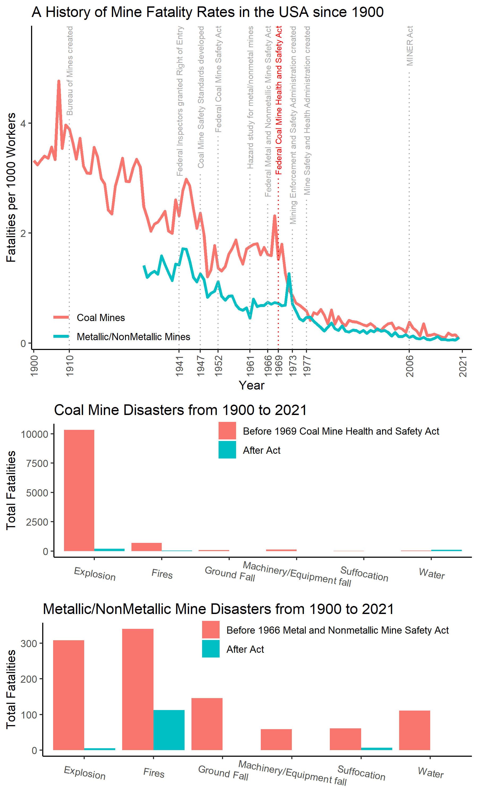

```{r setup, include=FALSE}
knitr::opts_chunk$set(echo = TRUE)
```

Pre-Load useful R packages.
```{r,warning=FALSE,message=FALSE,echo=FALSE}
library(tidyverse)
library(magrittr)
library(GGally)
library(ggplot2)
library(lubridate)
library(geomtextpath)
library(gridExtra)
library(ggpubr)
```

## USA Mining Safety data
This plot draws data from the US government website for the Mine Safety and Health Administrations.

* The data for fatalities can be found at:
https://arlweb.msha.gov/stats/centurystats/coalstats.asp
https://arlweb.msha.gov/stats/centurystats/mnmstats.asp

* Legislative events related to miner safety were taken from:
https://www.msha.gov/about/history

* Data for disasters with more than 5 people killed was taken from:
https://wwwn.cdc.gov/NIOSH-Mining/MMWC/MineDisasters/Table


# Fatality Rates
Read in the data for Miner fatalities from 1900 to present for both Coal mines and Metal/NonMetal Mines.
Calculate the fatality rate per 1000 miners employed that year to account for decrease in the number of workers in this industry.

```{r}
mines <- read.csv("miners.csv")
mines %<>% mutate(MiningSector=as.factor(MiningSector))
mines <- mines %>% mutate(Miners=str_replace(Miners,",",""),Fatalities=str_replace(Fatalities,",",""),Miners=str_replace(Miners,",",""),Fatalities=str_replace(Fatalities,",","")) %>% mutate(Miners=as.integer(Miners),Fatalities=as.integer(Fatalities))

mines %<>% mutate(perworkerfatality=1000.0*Fatalities/Miners)
#missing data for Metal and Mon Metal mines
# mines %>% filter(is.na(Miners))
```

Read in a list of major actions by the federal government related to mine safety.
```{r}
minehistory <- read.csv("MiningSafetyHistory.csv")
```

Create a plot that shows the rate of fatalities for coal mines versus non-coal mines (ie. metal, stone) and labels important historic points.  The 1969 legislation is highlighted because it is considered an important step because it created criminal and monitary punishments for safety violators.
```{r}

p_fatalities <- ggplot()+
  geom_line(data=mines,mapping=aes(x=Year,y=perworkerfatality,
                                   color=MiningSector),size=1.25)+
  theme_classic()+
  geom_textvline(data=minehistory %>% filter(Year!=1969),
                 mapping=aes(xintercept=Year,label=Event),
                 color="darkgrey",size=2.62,linetype="dotted",hjust=1)+
  geom_textvline(data=minehistory %>% filter(Year==1969),
                 mapping=aes(xintercept=Year,label=Event),
                 color="red",size=2.62,linetype="dotted",hjust=1)

```

```{r}
eventyear <- c(minehistory$Year,1900,2021)
p_fatalies_final <- p_fatalities+
  theme(legend.position=c(0.2,.08), 
        legend.title = element_blank(),
        legend.background = element_blank(),
        axis.text.x = element_text(angle = 90,vjust=0.5))+
  ylab("Fatalities per 1000 Workers")+
  scale_x_continuous(breaks=eventyear)+
  coord_cartesian(ylim=c(0.15,5.5),xlim=c(1905,2018))+
  scale_color_discrete(labels=c("Coal Mines","Metallic/NonMetallic Mines"))+
  ggtitle("A History of Mine Fatality Rates in the USA since 1900")
p_fatalies_final
ggsave("mine_fatalities.png",plot=p_fatalies_final)
```

# Types of Mining Disasters

Let's also look at the types of mining accidents and whether their distribution among categories has changed since the sixties.  The data is filtered from 1900 to present, giving about 70 years of data before and after the legislation. 

```{r}
disasters <- read.csv("MiningDisasters.csv")
disasters %<>% mutate(Mining.Sector=str_to_lower(Mining.Sector))
disasters %<>% mutate(Date=parse_date_time(Date,"mdy")) %>% mutate(Year=year(Date))
disasters %<>% mutate(across(c(Mine.Type,State,City,Mining.Sector,Mine.Type),as.factor))
disasters %>% head()
```
Using String Searches, let's try to lump Accident Types into general categories based on those named in
https://wwwn.cdc.gov/NIOSH-Mining/MMWC/MineDisasters/AccidentType#

```{r}
disasters %<>% mutate(AccidentCategory=NA)
disasters %<>% mutate(Accident.Type=str_to_lower(Accident.Type)) 

# classify with categories like https://wwwn.cdc.gov/NIOSH-Mining/MMWC/MineDisasters/AccidentType#
#can get a list of all accident types
# x <- unique(disasters$Accident.Type)
#can test searching for different string patterns in this list
# x[grepl("roof",x)]


disasters %<>% mutate(AccidentCategory=ifelse(grepl('explosion|detonat|blast|explosives|exposive',disasters$Accident.Type),"Explosion",AccidentCategory)) 
disasters %<>% mutate(AccidentCategory=ifelse(grepl('fire',disasters$Accident.Type),"Fires",AccidentCategory))
disasters %<>% mutate(AccidentCategory=ifelse(grepl('flood|water|inund|dam fail|snow',disasters$Accident.Type),"Water",AccidentCategory))
 disasters %<>% mutate(AccidentCategory=ifelse(grepl('suff|smoke|fumes|sulfide gas|inrush hot gases',disasters$Accident.Type),"Suffocation",AccidentCategory))
disasters %<>% mutate(AccidentCategory=ifelse(grepl('haul|hoist|drawbar|cage|man-car|crosshead',disasters$Accident.Type),"Machinery/Equipment fall",AccidentCategory))
disasters %<>% mutate(AccidentCategory=ifelse(grepl('cave-in|roof|fall of|fall and slide|slide of bank|snow|collapse load',disasters$Accident.Type),"Ground Fall",AccidentCategory))
# disasters %<>% mutate(AccidentCategory=ifelse(grepl('bump',disasters$Accident.Type),"Bump/Collapse with Bump",AccidentCategory))
disasters %<>% mutate(AccidentCategory=as.factor(AccidentCategory))
disasters %>% select(Accident.Type,AccidentCategory) %>% head()
```


Keep the type of mine consistent with our earlier plot.
```{r}
disasters %<>% mutate(CoalNonCoal=ifelse(disasters$Mining.Sector=='coal',"Coal Mines","Other Mines"))
```

Divide the data to times before and after the major safety legistation of the 60s.
```{r}
disasters %<>% mutate(beforeCoalAct=cut(year(Date),breaks=c(1800.,1969.,2022.)))
disasters %<>% mutate(beforeMetalAct=cut(year(Date),breaks=c(1800.,1966.,2022.)))
```

Plot the distributions of accident types
```{r}
disasters %>% head()
```


```{r}
disasters %>% filter(year(Date)>=1900) %>% group_by(CoalNonCoal) %>% summarise(z=sum(Killed))
noncoaldisaster <- disasters %>% filter(year(Date)>=1900,CoalNonCoal=="Other Mines") 
noncoaldisaster<- noncoaldisaster%>% group_by(beforeMetalAct,AccidentCategory) %>% summarise(Deaths=sum(Killed)) %>% ungroup() %>% complete(beforeMetalAct,AccidentCategory,fill=list(N=0,Deaths=0))

coaldisaster <- disasters %>% filter(year(Date)>=1900,CoalNonCoal=="Coal Mines")
coaldisaster<- coaldisaster %>% group_by(beforeCoalAct,AccidentCategory) %>% summarise(Deaths=sum(Killed)) %>% ungroup() %>% complete(beforeCoalAct,AccidentCategory,fill=list(N=0,Deaths=0))

```


```{r}
p_coal_accidents <- ggplot(data=coaldisaster %>% ungroup() %>% complete()
       )+geom_col(mapping=aes(x=AccidentCategory,y=Deaths,fill=beforeCoalAct),position="dodge")+
  ggtitle("Coal Mine Disasters from 1900 to 2021")+
  theme_classic()+
  theme(legend.position=c(0.65,.90), 
        legend.title = element_blank(),
        legend.background = element_blank(),
        axis.text.x = element_text(angle = -10,hjust=0.5,vjust=0.0))+
  ylab("Total Fatalities")+xlab("Accident Type")+
  scale_fill_discrete(labels=c("Before 1969 Coal Mine Health and Safety Act","After Act"))

p_metal_accidents <- ggplot(data=noncoaldisaster %>% ungroup() %>% complete()
       )+geom_col(mapping=aes(x=AccidentCategory,y=Deaths,fill=beforeMetalAct),position="dodge")+
    ggtitle("Metallic/NonMetallic Mine Disasters from 1900 to 2021")+
  theme_classic()+
  theme(legend.position=c(0.65,.90), 
        legend.title = element_blank(),
        legend.background = element_blank(),
        axis.text.x = element_text(angle = -10,hjust=0.5,vjust=0.0))+
  ylab("Total Fatalities")+xlab("Accident Type")+
  scale_fill_discrete(labels=c("Before 1966 Metal and Nonmetallic Mine Safety Act","After Act"))

p_metal_accidents
p_coal_accidents
ggsave("coal_mine_disasters.png",plot=p_coal_accidents)
ggsave("non_coal_mine_disasters.png",plot=p_metal_accidents)
```
```{r}
blankPlot <- ggplot()+geom_blank(aes(1,1))+
  theme(
    plot.background = element_blank(), 
   panel.grid.major = element_blank(),
   panel.grid.minor = element_blank(), 
   panel.border = element_blank(),
   panel.background = element_blank(),
   axis.title.x = element_blank(),
   axis.title.y = element_blank(),
   axis.text.x = element_blank(), 
   axis.text.y = element_blank(),
   axis.ticks = element_blank(),
   axis.line = element_blank()
     )

library(ggpubr)
combinedplot <- grid.arrange(p_fatalies_final,p_coal_accidents+rremove("xlab"),p_metal_accidents+rremove("xlab"),nrow=3,heights=c(2,1,1))

ggsave("Homework1Figure.png",combinedplot,width=6,height=10)
```

# Final Figure



